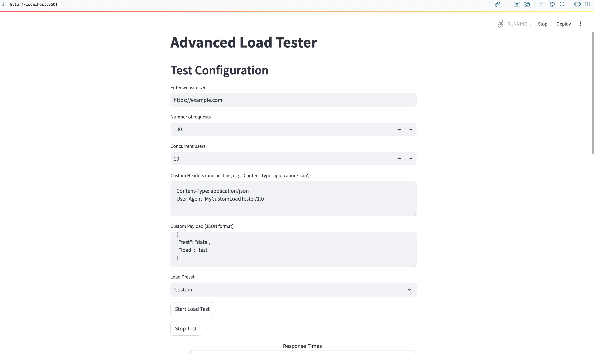
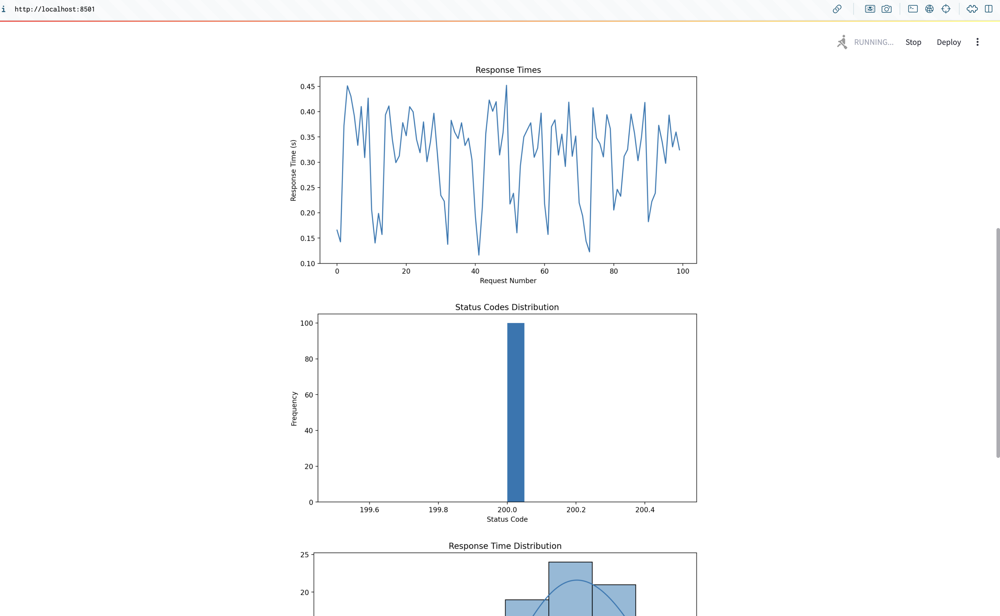
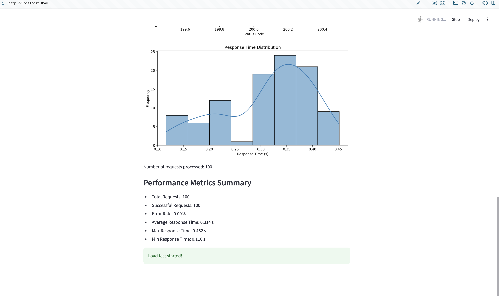

# HTTP Load Tester

This project serves as a general-purpose HTTP load-testing and benchmarking library. It is designed to provide accurate results, reporting latencies, error rates, and other performance metrics. The project includes a FastAPI backend to manage the load testing and a Streamlit frontend for real-time visualization of the test results. WebSocket is used for real-time communication between the server and the client.

## Features

- **Load Testing**: Supports sending multiple HTTP requests concurrently to a specified URL.
- **Real-time Visualization**: Uses Streamlit to display real-time charts of response times, status codes, and performance metrics.
- **WebSocket Communication**: Streams test results from the server to the client in real-time.
- **Configurable Parameters**: Allows customization of the number of requests, concurrency, custom headers, payloads, and queries per second (QPS).
- **Docker Support**: The application is fully containerized using Docker for easy deployment.

## API Design

### FastAPI Endpoints

- **`POST /start_test`**: Starts the load test with the given parameters.
- **`POST /stop_test`**: Stops the currently running load test.

### CLI Version
#### CLI Demo Video

[](https://www.loom.com/share/bc18d5653f8b4dd29e5c4e448e399355 "Demo of HTTP Load Tester Dockerised CLI APP")


- **Parameters**:
  - **`--url`**: URL to test
  - **`--num_requests`**: Number of requests to send
  - **`--concurrent_users`**: Number of concurrent users
  - **`--qps`**: Queries per second
  - **`--headers`**: Custom headers
  - **`--payload`**: Custom payload
  - **`--graph`**: Display graphs (True/False)

### Streamlit Frontend

- **Test Configuration**: Users can input the URL, number of requests, concurrent users, custom headers, and payload.
  - **Enter website URL**: e.g., `https://example.com`
  - **Number of requests**: e.g., `100`
  - **Concurrent users**: e.g., `10`
  - **Queries per second (QPS)**: e.g., `10`
  - **Custom Headers**: Enter custom headers one per line, e.g., `Content-Type: application/json`
  - **Custom Payload**: Enter custom payload in JSON format
  - **Load Preset**: Select from `Light Load`, `Medium Load`, `Heavy Load`, or `Custom`
- **Charts and Metrics**: Real-time charts for response times, status code distribution, and performance metrics summary.
- **Control Buttons**: Start and stop buttons to control the load test.

#### Streamlit Demo Video

[](https://www.loom.com/share/a28d1b3fe3f34391be947ca55717b1ff "Demo of HTTP Load Tester Dockerised Streamlit APP")


## Why Use WebSocket?

WebSocket is used for real-time communication between the server and the client. It allows the server to push updates to the client as soon as they are available, providing real-time feedback on the load test performance. This is crucial for monitoring and reacting to the load test results immediately.

## Functionalities of App and API Design

- **Load Testing**: The core functionality is to generate HTTP requests at a specified rate and concurrency level. The results of these requests are streamed in real-time to the client.
- **Real-time Streaming**: WebSocket is used to stream the test results from the FastAPI backend to the Streamlit frontend.
- **Visualization**: Real-time charts and metrics provide immediate feedback on the performance of the target URL.
- **Control**: Users can start and stop the load test from the Streamlit frontend, allowing for interactive testing.

## Steps to Run the Code

### Prerequisites

- Docker
- Python 3.12

### Clone the Repository

```bash
git clone https://github.com/aneena-manoj/HTTP-LOAD-TESTER.git
cd HTTP-LOAD-TESTER
```

### Build and Run the Docker Container for CLI Version

1. **Build the Docker Image**:
    ```sh
    docker build -f Dockerfile.cli -t cli-image .
    ```

2. **Run the Docker Container**:
    ```sh
    docker run -it --name cli-container -p 8000:8000 -p 8765:8765 cli-image
    ```

3. **Run the CLI Command within the Container**:
    ```sh
    ./run_cli.sh --url https://example.com --num_requests 100 --concurrent_users 10 --qps 10 --graph
    ```

### Build and Run the Docker Container for Streamlit Version

1. **Build the Docker Image**:
    ```sh
    docker build -f Dockerfile.streamlit -t streamlit-image .
    ```

2. **Run the Docker Container**:
    ```sh
    docker run -p 8501:8501 -p 8000:8000 -p 8765:8765 streamlit-image
    ```

### Access the Streamlit Application

- **Streamlit Frontend**: Open your browser and go to `http://localhost:8501`
- **FastAPI Backend**: The API is available at `http://localhost:8000`
- **WebSocket Server**: Running on `ws://localhost:8765`

### Screenshots

Here are some screenshots of the application in action:


*Custom Load Test Configuration*


*Custom Load Response Times Chart*


*Custom Load Response Times Chart and Performance Metrics Summary*

### Example Usage

1. **Configure the Test**: Enter the URL, number of requests, concurrent users, custom headers, and payload in the Streamlit app or CLI.
2. **Start the Test**: Click the "Start Load Test" button in the Streamlit app or run the CLI command to begin the test.
3. **Monitor the Results**: Watch the real-time charts and metrics update as the test runs in the Streamlit app.
4. **Stop the Test**: Click the "Stop Test" button in the Streamlit app or the CLI script will stop automatically after reaching the total number of requests.

### Sample Output

After running the load test, the sample output displayed in Streamlit or CLI is:

**Performance Metrics Summary**

- Total Requests: 200
- Successful Requests: 200
- Error Rate: 0.00%
- Average Response Time: 0.195 s
- Max Response Time: 0.350 s
- Min Response Time: 0.064 s

## Project Structure

```
HTTP-LOAD-TESTER/
│
├── src/
│   ├── load_test_api.py
│   ├── load_test_app.py
│   └── websocket_server.py
│
├── assets/
│   ├── custom_load1.png
│   ├── custom_load_response_times_chart.png
│   ├── custom_load_response_times_chart2.png
│   └── performance_metrics_summary.png
│
├── Dockerfile.cli
├── Dockerfile.streamlit
├── pyproject.toml
├── README.md
└── run_cli.sh
```


## Conclusion

This HTTP load tester provides a robust and flexible solution for benchmarking and performance testing of web applications. The combination of FastAPI, Streamlit, and WebSocket ensures real-time feedback and interactive testing, making it an invaluable tool for developers and QA engineers.